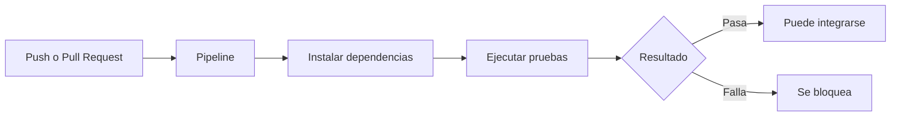

<style>
:root {
  --brand-green: #22C55E;
  --brand-blue: #38BDF8;
  --brand-dark: #0F172A;
  --brand-muted: #94A3B8;
}

.slidev-layout {
  background: radial-gradient(circle at top right, rgba(56,189,248,0.18), transparent 35%),
              radial-gradient(circle at bottom left, rgba(34,197,94,0.16), transparent 35%),
              #0F172A;
  color: #F8FAFC;
}

h1 {
  color: #F8FAFC;
  font-weight: 800;
}

h2,
h3 {
  color: #CBD5E1;
}

strong {
  color: #22C55E;
}

.card {
  background: rgba(15, 23, 42, 0.72);
  border: 1px solid rgba(148, 163, 184, 0.25);
  border-radius: 18px;
  padding: 22px;
  box-shadow: 0 20px 45px rgba(0,0,0,0.25);
}

.green {
  color: #22C55E;
}

.blue {
  color: #38BDF8;
}

.muted {
  color: #94A3B8;
}

.big-number {
  font-size: 72px;
  font-weight: 900;
  color: #22C55E;
  line-height: 1;
}

.quote {
  font-size: 30px;
  line-height: 1.35;
  font-weight: 700;
}

.small {
  font-size: 16px;
  color: #CBD5E1;
}
</style>

# CI/CD + Testing

## Calidad continua en proyectos open source

<div class="mt-10 text-2xl blue">
Del “en mi máquina funciona” al “validado automáticamente”
</div>

<div class="pt-16 muted">
QA Automation · FLISOL
</div>

---

# La pregunta inicial

<div class="quote mt-16">
¿Cómo mantenemos la calidad cuando muchas personas pueden contribuir al mismo proyecto?
</div>

<div class="mt-14 text-7xl">
🧪 ⚙️ 🌎
</div>

<div class="mt-8 muted">
Open source no solo es compartir código. También es construir confianza.
</div>

---

# El clásico problema

<div class="grid grid-cols-2 gap-8 mt-12">

<div class="card text-left">

## “En mi máquina funciona”

<div class="mt-6 text-xl">
Un cambio parece correcto localmente, pero rompe otra parte del sistema.
</div>

<div class="mt-8 muted">
El error aparece tarde, cuesta más corregirlo y afecta la confianza del proyecto.
</div>

</div>

<div class="flex items-center justify-center text-9xl">
💥
</div>

</div>

---

# En open source el reto crece

<div class="grid grid-cols-3 gap-6 mt-12">

<div class="card">
<div class="big-number">1</div>
<h3 class="mt-4">Muchos entornos</h3>
<p class="muted">Linux, Windows, macOS, distintas versiones y configuraciones.</p>
</div>

<div class="card">
<div class="big-number">2</div>
<h3 class="mt-4">Muchas personas</h3>
<p class="muted">Cada colaborador tiene su propio contexto y experiencia.</p>
</div>

<div class="card">
<div class="big-number">3</div>
<h3 class="mt-4">Muchos cambios</h3>
<p class="muted">Pull requests, issues, refactors, nuevas funcionalidades y bugs.</p>
</div>

</div>

<div class="mt-12 text-2xl green">
La calidad no puede depender solo de revisar manualmente.
</div>

---

# ¿Qué es CI/CD?

<div class="grid grid-cols-2 gap-8 mt-12 text-left">

<div class="card">

## CI

### Continuous Integration

<div class="mt-6 text-xl">
Cada cambio se integra y valida automáticamente.
</div>

<div class="mt-6 muted">
Compilar, instalar dependencias, analizar código y ejecutar pruebas.
</div>

</div>

<div class="card">

## CD

### Continuous Delivery / Deployment

<div class="mt-6 text-xl">
Después de validar, el proyecto puede preparar o publicar una versión.
</div>

<div class="mt-6 muted">
El despliegue deja de ser un evento riesgoso y pasa a ser un proceso repetible.
</div>

</div>

</div>

---

# CI/CD en una frase

<div class="quote mt-20">
CI/CD es automatizar confianza.
</div>

<div class="mt-12 text-2xl muted">
No reemplaza al equipo. Le da una red de seguridad.
</div>

<div class="mt-16 text-7xl">
🛡️
</div>

---

# Flujo básico



<div class="mt-10 text-2xl green">
Cada cambio pasa por una revisión automática.
</div>

---

# ¿Dónde entra QA Automation?

<div class="grid grid-cols-2 gap-8 mt-12">

<div class="card text-left">

## QA Automation

<div class="mt-6 text-xl">
Convierte validaciones repetitivas en pruebas automáticas.
</div>

<div class="mt-6 muted">
El QA no solo encuentra bugs. Ayuda a evitar que vuelvan.
</div>

</div>

<div class="card text-left">

## Ejemplos

- Login correcto
- Formularios inválidos
- Respuestas de API
- Cálculos críticos
- Flujos principales
- Bugs corregidos

</div>

</div>

---

# La idea clave

<div class="quote mt-20">
No se trata de probar todo.
</div>

<div class="quote mt-6 green">
Se trata de probar lo importante, temprano y siempre.
</div>

<div class="mt-16 muted">
Ese es el valor real de QA Automation dentro de CI/CD.
</div>

---

# Tipos de pruebas en un pipeline

| Tipo | Qué valida | Ejemplo |
|---|---|---|
| Unitarias | Funciones pequeñas | cálculo de descuento |
| Integración | Comunicación entre partes | API + base de datos |
| API Testing | Endpoints | login devuelve token |
| E2E | Flujo completo | usuario compra producto |
| Smoke Tests | Lo mínimo crítico | la app inicia correctamente |

<div class="mt-8 text-xl green">
No todo debe probarse desde la interfaz.
</div>

---

# Pirámide de testing

<div class="grid grid-cols-2 gap-8 mt-10">

<div class="card">

```text
        E2E
       /   \
   Integración
   /         \
 Unitarias
```

</div>

<div class="text-left text-xl">

<div class="card">

### Lectura práctica

- Muchas pruebas unitarias
- Algunas de integración
- Pocas E2E
- Smoke tests para validar lo crítico

</div>

</div>

</div>

<div class="mt-8 muted">
Mientras más rápida y estable sea una prueba, más seguido puede ejecutarse.
</div>

---

# Demo aplicada

## Proyecto simple

```text
open-source-quality-demo/
├── src/
│   └── calculator.js
├── tests/
│   └── calculator.test.js
├── package.json
└── .github/
    └── workflows/
        └── ci.yml
```

<div class="mt-10 text-xl blue">
Objetivo: ver cómo un pipeline detecta automáticamente un error.
</div>

---

# Código base

```js
function sum(a, b) {
  return a + b;
}

function calculateDiscount(price, discountPercent) {
  return price - (price * discountPercent / 100);
}

module.exports = {
  sum,
  calculateDiscount
};
```

<div class="mt-8 text-xl green">
Una función pequeña también representa una regla de negocio.
</div>

---

# Prueba automatizada

```js
const { sum, calculateDiscount } = require('../src/calculator');

test('should sum two numbers correctly', () => {
  expect(sum(2, 3)).toBe(5);
});

test('should calculate discount correctly', () => {
  expect(calculateDiscount(100, 20)).toBe(80);
});
```

<div class="mt-8 text-xl">
Esta prueba protege una regla:
<strong>100 con 20% de descuento debe dar 80.</strong>
</div>

---

# Pipeline con GitHub Actions

```yaml
name: CI - Testing

on:
  push:
    branches: [ main ]
  pull_request:
    branches: [ main ]

jobs:
  test:
    runs-on: ubuntu-latest

    steps:
      - name: Descargar código
        uses: actions/checkout@v4

      - name: Configurar Node.js
        uses: actions/setup-node@v4
        with:
          node-version: 20

      - name: Instalar dependencias
        run: npm install

      - name: Ejecutar pruebas
        run: npm test
```

---

# Ahora rompamos algo

```js
function calculateDiscount(price, discountPercent) {
  return price + (price * discountPercent / 100);
}
```

<div class="grid grid-cols-2 gap-8 mt-10">

<div class="card">
<h3>Antes</h3>
<div class="text-3xl green mt-4">100 - 20% = 80</div>
</div>

<div class="card">
<h3>Ahora</h3>
<div class="text-3xl text-red-400 mt-4">100 + 20% = 120</div>
</div>

</div>

---

# El pipeline falla

<div class="text-8xl mt-10">
🚨
</div>

<div class="quote mt-10">
Un pipeline fallando no siempre es una mala noticia.
</div>

<div class="mt-8 text-2xl green">
Es una alerta temprana antes de romper el proyecto.
</div>

---

# ¿Qué ganamos?

<div class="grid grid-cols-2 gap-8 mt-12">

<div class="card text-left">

## Sin pipeline

- Revisiones manuales
- Errores detectados tarde
- Cambios riesgosos
- Baja confianza
- Más retrabajo

</div>

<div class="card text-left">

## Con pipeline

- Validación automática
- Errores detectados antes
- Pull requests más seguros
- Más confianza
- Mejor colaboración

</div>

</div>

---

# Buenas prácticas open source

<div class="grid grid-cols-2 gap-6 mt-10 text-left">

<div class="card">

### Para empezar

- Ejecutar pruebas en cada pull request
- Documentar cómo correr tests
- Automatizar flujos críticos

</div>

<div class="card">

### Para mejorar

- Bloquear merge si falla el pipeline
- Agregar pruebas por cada bug corregido
- Revisar reportes, no solo verde o rojo

</div>

</div>

---

# Herramientas útiles

<div class="grid grid-cols-3 gap-6 mt-10 text-left">

<div class="card">
<h3>CI/CD</h3>
<p class="muted">GitHub Actions<br>GitLab CI</p>
</div>

<div class="card">
<h3>Unit Testing</h3>
<p class="muted">Jest<br>Pytest<br>JUnit</p>
</div>

<div class="card">
<h3>E2E</h3>
<p class="muted">Playwright<br>Selenium<br>Cypress</p>
</div>

<div class="card">
<h3>API Testing</h3>
<p class="muted">Newman<br>Bruno<br>REST Assured</p>
</div>

<div class="card">
<h3>Calidad</h3>
<p class="muted">ESLint<br>SonarQube Community</p>
</div>

<div class="card">
<h3>Reportes</h3>
<p class="muted">Allure Report<br>HTML Reports</p>
</div>

</div>

---

# Error común

<div class="quote mt-16">
“Vamos a automatizar todo.”
</div>

<div class="mt-12 text-2xl muted">
No todo debe automatizarse desde el inicio.
</div>

<div class="mt-8 text-2xl green">
Empieza por lo crítico, repetitivo y estable.
</div>

---

# Qué puede aportar un QA al open source

<div class="grid grid-cols-2 gap-8 mt-12 text-left">

<div class="card">

## Sin escribir una feature

- Reportar bugs claros
- Mejorar casos de prueba
- Reproducir errores
- Validar issues abiertos
- Documentar pasos de prueba

</div>

<div class="card">

## Con automatización

- Crear tests unitarios
- Agregar pruebas de API
- Mejorar pipelines
- Crear smoke tests
- Evitar regresiones

</div>

</div>

---

# Mini roadmap para empezar

<div class="grid grid-cols-3 gap-6 mt-12">

<div class="card">
<div class="big-number">1</div>
<h3 class="mt-4">Clona</h3>
<p class="muted">Busca un proyecto open source e instálalo.</p>
</div>

<div class="card">
<div class="big-number">2</div>
<h3 class="mt-4">Prueba</h3>
<p class="muted">Ejecuta sus tests y revisa qué falla.</p>
</div>

<div class="card">
<div class="big-number">3</div>
<h3 class="mt-4">Aporta</h3>
<p class="muted">Reporta, documenta o agrega una prueba.</p>
</div>

</div>

---

# Cierre

<div class="quote mt-14">
El software libre crece con colaboración.
</div>

<div class="quote mt-6 green">
Pero la colaboración necesita confianza.
</div>

<div class="mt-12 text-2xl">
CI/CD + Testing permite validar cada cambio de forma automática, repetible y transparente.
</div>

---

# Mensaje final

<div class="quote mt-16">
Como QA Automation, también puedes aportar al software libre.
</div>

<div class="mt-10 text-3xl blue">
No solo encontrando errores.
</div>

<div class="mt-4 text-3xl green">
Construyendo confianza.
</div>

---

# Gracias

## Preguntas

<div class="mt-12 text-6xl">
💚 🧪 ⚙️
</div>

<div class="mt-10 muted">
CI/CD + Testing · Calidad continua en proyectos open source
</div>
